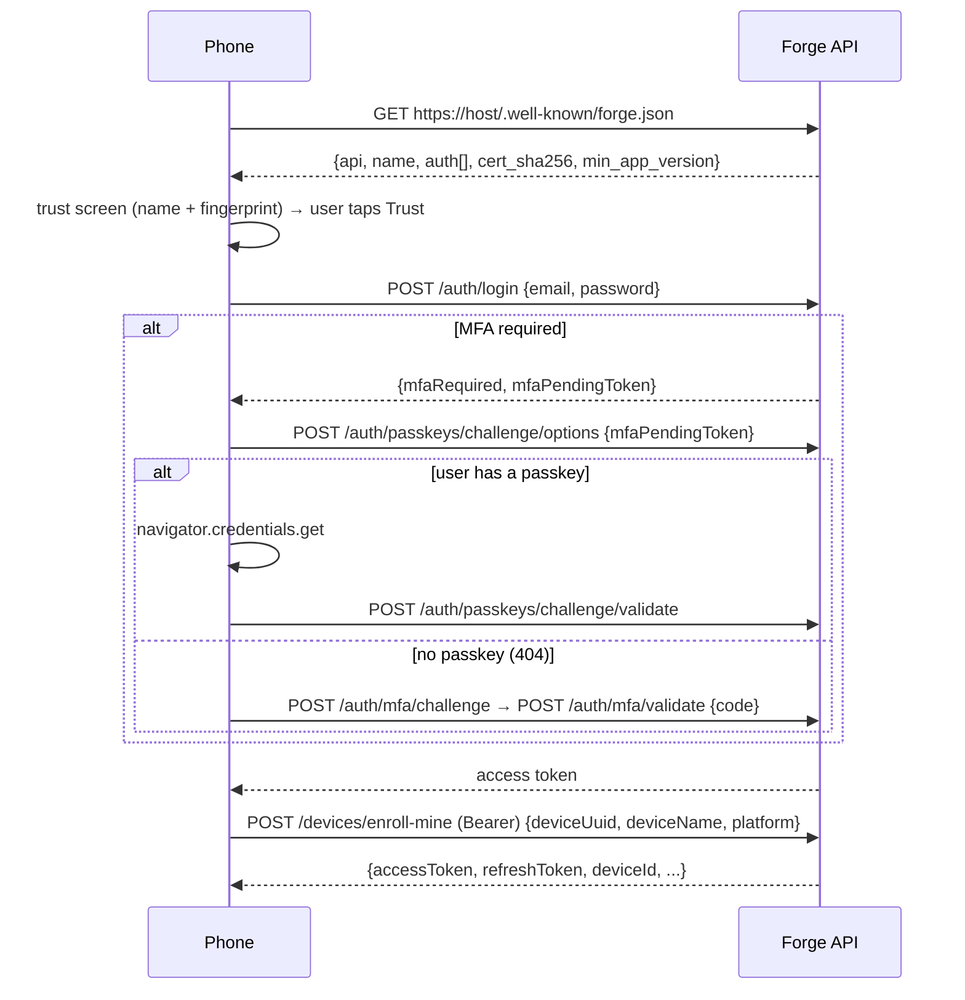
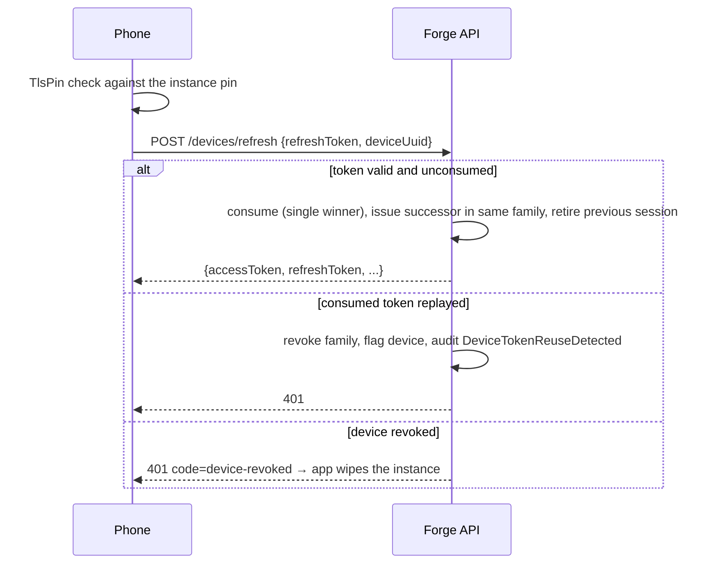

# Mobile enrollment and auth (as implemented, step 3)

Server: `forge-api` `DevicesController`, `PasskeysController`, `WellKnownController`,
`SharedDeviceMiddleware`, `DbSessionStore`. Client: `forge-ui` `shared/services/{instance,
mobile-auth,token-storage,local-lock,shared-identity,passkey,tls-pin}.service.ts`,
`features/mobile-app/{enroll,lock,identity}`.

## Credentials

| Credential | Where minted | At rest (server) | At rest (device) | Lifetime |
|---|---|---|---|---|
| Enrollment token | admin "Add a device" | SHA-256 in `device_enrollment_tokens` | never stored (QR only) | 10 min, single use |
| Refresh token | enroll / refresh | SHA-256 in `device_refresh_tokens` (family id) | Keychain/Keystore `forge-mobile-refresh:{instance}` | 90 days sliding, rotates on every use |
| Access token (JWT) | enroll / refresh / scan-login | `user_sessions` row per JTI | memory, mirrored to Keychain (`forge-token`) | existing setting (24 h; 8 h scan-login) |
| Shared-device credential | enroll-shared | SHA-256 on `user_devices.device_token_hash` | Keychain `forge-mobile-device-token:{instance}` | until revoked |
| Local PIN | lock setup on device | — | salted SHA-256 in Keychain | until reset; 10 failures wipe the instance |
| TOFU cert pin | QR / `.well-known` | Mobile options `CertSha256` | in the instance record | until re-enrollment |

Replay of a consumed refresh token revokes the whole family, flags the device, and writes
`DeviceTokenReuseDetected` to `audit_log_entries`. Revoked devices get `401` with
`code: "device-revoked"` from refresh and from `SharedDeviceMiddleware`; the app wipes that
instance and returns to first-run.

## QR enrollment (personal device)

```mermaid
sequenceDiagram
  participant A as Admin (desktop)
  participant S as Forge API
  participant P as Phone
  A->>S: POST /devices/enrollment-tokens {targetUserId}
  S-->>A: {token, expiresAt, instanceName, certSha256}
  A-->>P: QR {server, token, name, certSha256, shared:false}
  P->>P: TlsPin.fingerprint(host) == certSha256 (hard stop on mismatch)
  P->>S: POST /devices/enroll {token, deviceUuid, deviceName, platform, os, app}
  S->>S: consume token (single winner), upsert user_devices, mint refresh family, session
  S-->>P: {accessToken, refreshToken, deviceId, deviceName, user}
  P->>P: store instance + refresh in Keychain; /app/setup-lock (PIN → biometric) → /app/scan
```

## Manual enrollment



## Refresh (every 401 on the shell)



## Shared device

Enrolled to the instance (`POST /devices/enroll-shared`, admin "Shared device" QR). The
device credential rides as `X-Device-Token` on every request; `SharedDeviceMiddleware`
rejects revoked devices. No device PIN lock. Each transaction starts with
`IdentityPromptComponent`: badge scan → 4-digit PIN → `POST /auth/scan-login`; the person's
session is attributed to the device (`user_sessions.user_device_id`) and clears after the
transaction or 60 idle seconds.

## Local unlock

`LocalLockService`: 6-digit PIN (salted SHA-256, Keychain) with optional biometric
(`@aparajita/capacitor-biometric-auth`); idle timeout from `GET /devices/lock-policy`
(office roles 15 min, floor 8 h; admin-configurable via system settings
`mobile.idle_timeout_{office,floor}_minutes`); locking hides the app behind `/app/lock`
without logging out or touching the offline queue; ten failures wipe the instance.

## Multiple instances

`InstanceService` keeps a list with one active instance; credentials are namespaced per
instance in secure storage and nothing crosses. `MobileAuthService.switchInstance(id)`
swaps origin + session. Removing an instance wipes its credentials. The list UI lands with the
Account screen.

## Not verifiable on the build machine

Native binaries (Android/iOS) and the Postgres-collection tests need a docker-capable box
and a Mac respectively. The iOS `TlsPinPlugin.swift` must be added to the App target in Xcode.
